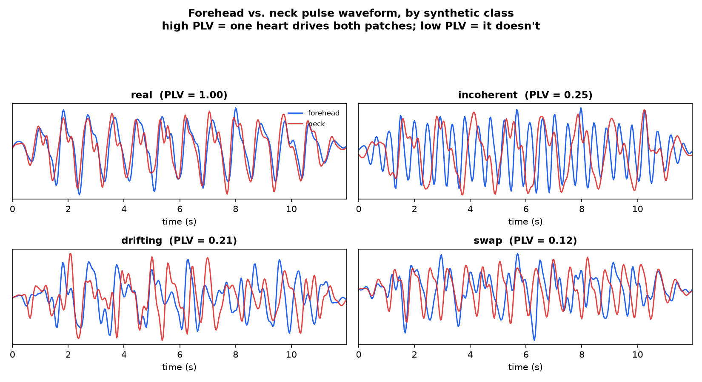

# physio-forensics

**A deepfake detector that never looks at whether a face *looks* fake.**
**It checks whether there is a living cardiovascular system underneath it.**

[](LICENSE)
[](pyproject.toml)
[](tests/test_pipeline.py)
[](#technology)

---

## The idea, in one paragraph

Every time your heart beats, blood is pushed into the capillaries just beneath your skin, changing its colour by a fraction most cameras can barely see and no human eye can see at all. Recovering that signal from ordinary video is called **remote photoplethysmography (rPPG)** — hospitals and fitness apps already use it to read heart rate from a webcam. This project repurposes it as a forensic instrument: instead of asking *"does this face look synthetic?"*, it asks *"do four separate patches of skin — forehead, both cheeks, and the neck — agree on a single cardiac rhythm, with the correct pulse-transit timing between them?"* That agreement is called **phase coherence**, and it is a physical constraint no video generator has ever been trained to satisfy.

> To spot a forged painting, you don't squint at the brushstrokes — a good forger paints better than you can judge. You X-ray the canvas. This is the X-ray.

## Why this isn't just "detect deepfakes with heart rate"

rPPG-based deepfake detection already exists — [FakeCatcher](https://arxiv.org/abs/1901.02212) (TPAMI 2020) and [DeepFakesON-Phys](https://arxiv.org/abs/2010.00400) (2020) both showed a real pulse is hard to fake. That finding is no longer sufficient on its own: [Harraq & Aldwairi (2026)](https://arxiv.org/abs/2607.21776) reproduced DeepFakesON-Phys and found it collapses from **0.999 AUC** on legacy face-swaps to **0.622 AUC** on modern talking-face generators, because those generators now train on enough real video to reproduce a *plausible pulse spectrum* by accident.

**This project's position:** a plausible pulse spectrum in one patch of skin is now cheap for a generator to fake. A *shared phase*, held constant across four spatially separated patches with the correct pulse-transit delays between them, is not — nothing in a generator's training objective rewards it. So instead of asking "is there a heartbeat here," the decision variable becomes "do all these heartbeats belong to the same heart."

## How it works

```
video.mp4
    │
    ▼
┌─────────────────────────────────────────────┐
│  track 4 skin regions: forehead, L/R cheek,  │
│  neck — the neck is the control: in a face-  │
│  swap it belongs to the real, unmodified body│
└─────────────────────┬─────────────────────────┘
                       ▼
┌─────────────────────────────────────────────┐
│  POS / CHROM projection → bandpass filter    │
│  → 4 independent pulse waveforms             │
└─────────────────────┬─────────────────────────┘
                       ▼
        ┌──────────────┴──────────────┐
        ▼                             ▼
┌───────────────────┐      ┌───────────────────────┐
│ per-region quality │      │ cross-region coherence│
│ SNR, entropy,      │      │ phase-locking value,  │
│ periodicity (26)   │      │ correlation, HR gap   │
│ — what prior work  │      │ (18) — this project's │
│ relies on          │      │ actual contribution   │
└──────────┬──────────┘      └───────────┬───────────┘
           └───────────────┬─────────────┘
                            ▼
              small gradient-boosted classifier
                            ▼
        "0.999 → FAKE — face reports 71 bpm,
                neck reports 88 bpm"
```

**Phase Locking Value (PLV)** is the core measurement. Two region signals are narrow-band filtered around the same cardiac frequency, their instantaneous phase is extracted with a Hilbert transform, and PLV measures how *constant* the phase difference between them stays:

```
PLV = | mean( exp( i · (φ_a − φ_b) ) ) |        1.0 → one heart drives both patches
                                                 0.0 → no shared driver
```

Everything — the 44 named features, the classifier, the CLI — is built to make that one number, and its five-way breakdown, defensible and explainable.

## Results

Public deepfake corpora (FaceForensics++, Celeb-DF) sit behind approval forms that take days to clear, so this repo ships a synthetic renderer that produces video with **exactly known** physiology — enough to validate the entire signal chain before any real dataset arrives.

```
$ python -m physioforensics.cli selftest

class        true bpm  est bpm    err  snr dB  plv face  plv neck  spread
---------------------------------------------------------------------------
real             60.0     59.8    0.2   13.13     0.998     0.996     0.2
nopulse          60.0    126.3   66.3   -3.42     0.645     0.473    95.8
incoherent       60.0    116.9   56.9   13.53     0.416     0.361    32.3
drifting         60.0     61.5    1.5   -1.14     0.287     0.257    15.8
swap             60.0     91.6   31.6    1.56     0.185     0.424    56.7
```

The pipeline recovers an injected heart rate to within **0.2 bpm**. The row worth reading twice is `incoherent`: its SNR (**+13.53 dB**) is marginally *higher* than genuine video's (**+13.13 dB**) — every region carries a clean, strong pulse, they just disagree with each other. Any detector built on signal quality alone waves it through. Phase coherence catches it, **0.416 vs 0.998**. That one row is the entire argument for the project.

Seeing it is more convincing than the table. This is the forehead and neck pulse waveform extracted by the actual pipeline (`physioforensics waveforms`, no numbers hand-picked or touched up):



`real` is two lines tracing one heartbeat. Every forgery is two lines that stop agreeing on where the beat falls — that visual gap *is* the detector.

### Leave-one-generator-out — the protocol that actually matters

Hold out one forgery method completely, train on the rest, test blind on the unseen one — simulating the real question: *will this still work on a generator that didn't exist when the model was trained?*

| Held-out generator | quality features only | coherence features |
|---|---:|---:|
| nopulse    | 1.000 | 1.000 |
| drifting   | 1.000 | 1.000 |
| swap       | 0.890 | **1.000** |
| incoherent | 0.575 | **0.925** |
| **mean**   | 0.866 | **0.981** |

On the held-out `incoherent` generator — the case designed to be invisible to quality-based methods — quality features collapse to near-chance (0.575) while coherence holds at 0.925. Coherence-only (0.981 mean AUC) also **beats the combined feature set** (0.894): quality features don't just fail to help against unseen generators, they actively mislead, because their statistics are generator-specific in a way phase coherence is not.

> **Read this before quoting a number.** These results are on synthetic data, constructed to model *physical failure modes*, not to imitate any real generator. They validate that the instrument measures what it claims to measure and that the ablation behaves as predicted — they are not a benchmark claim. Headline numbers need to come from FaceForensics++ / Celeb-DF v2 against published baselines; the evaluation harness is written and waiting on dataset access. Full grid in `docs/results.csv`.

## Quickstart

```bash
pip install -r requirements.txt

# 1. validate the signal chain against known physiology — no data needed, ~10s
python -m physioforensics.cli selftest

# 2. reproduce every number above end to end, ~2 min
make demo

# 3. explain a single video in plain language
python -m physioforensics.cli analyze path/to/video.mp4 --model models/physio.joblib
```

```
swap_000.mp4
==============================================================
frames 300 @ 30.0 fps (10.0s)
regions with usable signal: forehead, left_cheek, right_cheek, neck
--------------------------------------------------------------
  Pulse signal strength across regions: +0.7 dB (a cardiac peak stands out from noise).
  Phase agreement between forehead and cheeks: 0.27 (regions are out of step with each other).
  Phase agreement between face and neck: 0.19 (face and body disagree, typical of a swap).
  Spread of heart-rate estimates across regions: 53.0 bpm.
  Face-vs-neck heart-rate difference: 21.5 bpm.
--------------------------------------------------------------
  Model probability of forgery: 0.999  -> FAKE
```

### Using a real corpus

Arrange any dataset as `real/` and `fake_<generator>/` subfolders — the folder name becomes the generator label that drives leave-one-generator-out evaluation:

```bash
python -m physioforensics.cli features --root data/faceforensics --out feats.csv --workers 4
python -m physioforensics.cli evaluate --table feats.csv --out results.csv
```

## Technology

**No deep learning framework. No pretrained weights. No GPU.** That's a design decision, not a limitation:

| Choice | Reasoning |
|---|---|
| Classical rPPG (POS / CHROM), hand-implemented in NumPy | Published comparisons show classical extractors match or beat learned ones — there's no accuracy on the table by going deep |
| Gradient boosting over 44 *named* physical features | A CNN can't justify a verdict in one sentence; a forensic tool that can't explain itself has limited value as evidence |
| SciPy `filtfilt` for all filtering | Zero-phase — an ordinary filter delays frequencies unevenly and would silently corrupt the phase relationships this method is built on |
| OpenCV for decode + face detection | Ships with every codec and a bundled Haar cascade — no model download, no network dependency at install |
| CPU-only pipeline | Training takes under a second; the full demo runs in ~2 minutes on a laptop; there's no gradient path through a Hilbert transform to attack |

## Repository layout

```
physioforensics/
  rppg.py       POS / CHROM / GREEN extraction, spectral analysis, phase-locking value
  regions.py    face tracking, 4-region ROI extraction, skin masking
  features.py   the two feature families + plain-language explanations
  synth.py      controlled-physiology synthetic video renderer (5 classes)
  dataset.py    corpus walking, feature tables, family definitions
  train.py      random-split and leave-one-generator-out evaluation protocols
  plotting.py   forehead-vs-neck pulse waveform comparison plot
  cli.py        selftest / synth / features / evaluate / importance / train / analyze / waveforms
tests/          22 tests asserting physical correctness, not just execution
docs/           committed result tables
```

## Tests

```bash
pytest -q     # 22 passed
```

The suite checks physics, not just that the code runs: every extractor recovers an injected heart rate, forgeries measurably lose phase coherence, a face-swap produces a face-vs-neck mismatch, and — as an executable assertion — **coherence catches cases that per-region signal quality waves through.**

## Roadmap

1. Real-corpus evaluation on FaceForensics++ / Celeb-DF++ (dataset requests pending)
2. Reproduce the published DeepFakesON-Phys degradation, then test whether coherence recovers it
3. **Generator attribution** — per-generator difficulty is reportedly stable, implying each generator leaves a distinguishable physiological fingerprint; predicting *which* generator produced a video is the strongest open research angle here
4. Mains-flicker (ENF) as a second, independent physical channel

## References

- Ciftci, Demir & Yin. [FakeCatcher: Detection of Synthetic Portrait Videos using Biological Signals](https://arxiv.org/abs/1901.02212). TPAMI 2020.
- Hernandez-Ortega et al. [DeepFakesON-Phys: DeepFakes Detection based on Heart Rate Estimation](https://arxiv.org/abs/2010.00400). 2020.
- Harraq & Aldwairi. [Physiological Signals as a Forensic Modality for Talking-Face Deepfake Detection](https://arxiv.org/abs/2607.21776). July 2026.
- Wang et al. [Algorithmic Principles of Remote-PPG](https://pure.tue.nl/ws/files/31563684/TBME_00467_2016_R1_preprint.pdf). TBME 2017. (POS)
- de Haan & Jeanne. Robust Pulse Rate from Chrominance-Based rPPG. TBME 2013. (CHROM)

## License

MIT — see [LICENSE](LICENSE).
